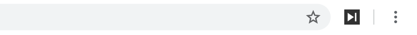

# Skip Ad

Chrome Extension To Skip YouTube Ads.

## Icon

## How it works

The extension will look for **Skip Ad,** **Skip Ads,** and **X** buttons, and trigger the **click()** on them to close the ad.
It is the same kind of click you would have to do manually to close the ad, once you see the button.
